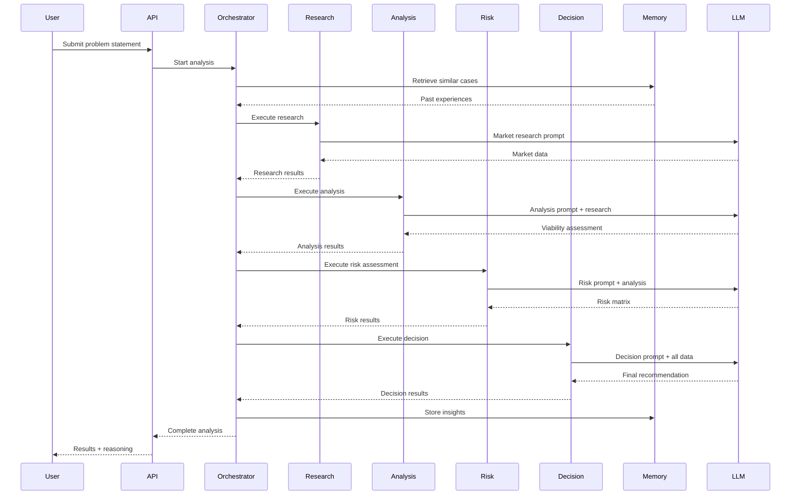

# 🏗️ AegisAI System Architecture

This document provides a comprehensive overview of the AegisAI system architecture, design decisions, and technical implementation details.

---

## Table of Contents

- [System Overview](#system-overview)
- [Architecture Layers](#architecture-layers)
- [Multi-Agent System](#multi-agent-system)
- [Data Flow](#data-flow)
- [Database Schema](#database-schema)
- [API Design](#api-design)
- [Security](#security)
- [Scalability](#scalability)

---

## System Overview

AegisAI is built on a modern, scalable architecture that separates concerns across three main layers:

1. **Presentation Layer** (Frontend) - Next.js 14 with TypeScript
2. **Application Layer** (Backend) - FastAPI with Python
3. **Data Layer** - MongoDB Atlas + ChromaDB Vector Store

### High-Level Architecture

```
┌─────────────────────────────────────────────────────────────┐
│                     Frontend (Next.js)                      │
│  ┌──────────┐  ┌──────────┐  ┌──────────┐  ┌──────────┐   │
│  │  Pages   │  │Components│  │   Hooks  │  │   API    │   │
│  └──────────┘  └──────────┘  └──────────┘  └──────────┘   │
└────────────────────────┬────────────────────────────────────┘
                         │ HTTPS/REST
┌────────────────────────┴────────────────────────────────────┐
│                    Backend (FastAPI)                        │
│  ┌──────────────────────────────────────────────────────┐  │
│  │            Agent Orchestrator                        │  │
│  │  ┌──────┐  ┌──────┐  ┌──────┐  ┌──────┐            │  │
│  │  │Research│→│Analysis│→│ Risk │→│Decision│           │  │
│  │  │ Agent  │  │ Agent  │  │Agent │  │ Agent  │       │  │
│  │  └──────┘  └──────┘  └──────┘  └──────┘            │  │
│  └──────────────────────────────────────────────────────┘  │
│  ┌──────────┐  ┌──────────┐  ┌──────────┐                 │
│  │   API    │  │  Memory  │  │ Reasoning│                 │
│  │  Routes  │  │  System  │  │  Logger  │                 │
│  └──────────┘  └──────────┘  └──────────┘                 │
└────────────────────────┬────────────────────────────────────┘
                         │
┌────────────────────────┴────────────────────────────────────┐
│                    Data Layer                               │
│  ┌──────────────┐              ┌──────────────┐            │
│  │   MongoDB    │              │   ChromaDB   │            │
│  │    Atlas     │              │ Vector Store │            │
│  │ (Documents)  │              │  (Embeddings)│            │
│  └──────────────┘              └──────────────┘            │
└─────────────────────────────────────────────────────────────┘
```

---

## Architecture Layers

### 1. Frontend Layer

**Technology**: Next.js 14 (App Router), TypeScript, Tailwind CSS

**Responsibilities**:
- User interface rendering
- State management
- API communication
- Real-time updates
- Form validation

**Key Components**:

```
src/
├── app/                    # Next.js App Router
│   ├── page.tsx           # Homepage
│   ├── analysis/          # Analysis pages
│   │   ├── page.tsx       # Create analysis
│   │   └── [id]/          # View analysis
│   └── history/           # Analysis history
├── components/
│   ├── analysis/          # Analysis-specific components
│   │   ├── ResultCard.tsx
│   │   ├── ReasoningTimeline.tsx
│   │   └── AgentProgress.tsx
│   ├── feedback/          # Feedback components
│   └── ui/                # Reusable UI components
├── lib/
│   ├── api.ts             # API client
│   └── utils.ts           # Utilities
└── types/
    └── index.ts           # TypeScript definitions
```

**Design Patterns**:
- **Component Composition**: Reusable, composable components
- **Custom Hooks**: Encapsulated logic (useAnalysis, usePolling)
- **Server Components**: Leverage Next.js 14 RSC for performance
- **Client Components**: Interactive UI with 'use client' directive

---

### 2. Backend Layer

**Technology**: FastAPI, Python 3.11+, Pydantic

**Responsibilities**:
- API endpoint handling
- Agent orchestration
- Business logic
- Data validation
- External API integration

**Key Modules**:

```
app/
├── main.py                # FastAPI application
├── config.py              # Configuration management
├── agents/                # Multi-agent system
│   ├── base.py           # Base agent class
│   ├── orchestrator.py   # Agent coordinator
│   ├── research.py       # Research agent
│   ├── analyst.py        # Analysis agent
│   ├── risk.py           # Risk agent
│   └── decision.py       # Decision agent
├── api/
│   └── routes/           # API endpoints
│       ├── analysis.py
│       ├── history.py
│       └── feedback.py
├── db/
│   ├── database.py       # MongoDB connection
│   └── models.py         # Beanie ODM models
├── memory/
│   └── vector_store.py   # ChromaDB integration
├── reasoning/
│   └── logger.py         # Reasoning transparency
└── schemas/              # Pydantic schemas
    ├── agent.py
    ├── analysis.py
    └── feedback.py
```

**Design Patterns**:
- **Dependency Injection**: FastAPI's DI system
- **Repository Pattern**: Data access abstraction
- **Strategy Pattern**: Interchangeable agent implementations
- **Observer Pattern**: Real-time status updates

---

### 3. Data Layer

**Databases**:

1. **MongoDB Atlas** (Primary Database)
   - Document storage for analyses
   - User feedback
   - Historical data
   - Reasoning logs

2. **ChromaDB** (Vector Store)
   - Semantic memory
   - Similar case retrieval
   - Embedding storage

---

## Multi-Agent System

### Agent Architecture

Each agent follows a consistent interface defined by `BaseAgent`:

```python
class BaseAgent(ABC):
    @abstractmethod
    def get_system_prompt(self) -> str:
        """Define agent's role and expertise"""
        
    @abstractmethod
    def format_task(self, input_data: AgentInput) -> str:
        """Format the task for the LLM"""
        
    @abstractmethod
    def parse_response(self, response: str) -> Dict[str, Any]:
        """Parse LLM response into structured data"""
        
    async def execute(self, input_data: AgentInput) -> AgentOutput:
        """Execute the agent's task"""
```

### Agent Workflow



### Agent Responsibilities

#### 1. Research Agent 🔍
**Purpose**: Gather market intelligence and competitive landscape

**Outputs**:
- Market size and growth rate
- Key trends and drivers
- Competitor analysis
- Target audience insights
- Market opportunities

**LLM Prompt Strategy**: Structured JSON output with market research framework

---

#### 2. Analysis Agent 📊
**Purpose**: Evaluate viability across multiple dimensions

**Outputs**:
- Market viability score (0-1)
- Technical feasibility assessment
- Business model analysis
- Competitive positioning
- Overall analysis score

**Evaluation Criteria**:
- Market size and growth
- Product-market fit
- Technical complexity
- Resource requirements
- Competitive advantage

---

#### 3. Risk Agent ⚠️
**Purpose**: Identify and assess potential risks

**Outputs**:
- Risk matrix (severity × probability)
- Risk categories (market, technical, financial, operational)
- Mitigation strategies
- Overall risk score
- Critical risk flags

**Risk Assessment Framework**:
- **Severity**: Critical, High, Medium, Low
- **Probability**: Very Likely, Likely, Possible, Unlikely
- **Impact Score**: 0-1 (calculated)

---

#### 4. Decision Agent 🎯
**Purpose**: Synthesize all data into actionable recommendation

**Outputs**:
- Verdict: GO / NO-GO / CONDITIONAL
- Confidence score (0-1)
- Executive summary
- Key factors (positive/negative)
- Recommendations
- Next steps

**Decision Logic**:
```
IF overall_analysis_score > 0.7 AND overall_risk_score < 0.5:
    verdict = GO
ELIF overall_analysis_score > 0.5 AND overall_risk_score < 0.7:
    verdict = CONDITIONAL
ELSE:
    verdict = NO-GO
```

---

## Data Flow

### 1. Analysis Creation Flow

```
User Input
    ↓
Frontend Validation
    ↓
POST /api/v1/analysis
    ↓
Create Analysis Document (status: pending)
    ↓
Background Task: run_analysis()
    ↓
Agent Orchestrator
    ├─→ Research Agent → Update status: researching
    ├─→ Analysis Agent → Update status: analyzing
    ├─→ Risk Agent → Update status: assessing_risks
    └─→ Decision Agent → Update status: deciding
    ↓
Store Results in MongoDB
    ↓
Update status: completed
    ↓
Store Insights in Vector DB
    ↓
Return Results to Frontend
```

### 2. Real-time Status Updates

```
Frontend
    ↓
Polling: GET /api/v1/analysis/{id}/status (every 2s)
    ↓
Backend checks current status
    ↓
Return: {status, current_agent, progress_percentage}
    ↓
Frontend updates UI
    ↓
Repeat until status = completed/failed
```

---

## Database Schema

### MongoDB Collections

#### 1. `analyses` Collection

```javascript
{
  _id: ObjectId,
  analysis_id: UUID,  // Public ID
  problem_statement: String,
  context: String,
  status: Enum["pending", "researching", "analyzing", "assessing_risks", "deciding", "completed", "failed"],
  current_agent: String,
  progress_percentage: Number,
  
  // Results
  decision: {
    verdict: Enum["GO", "NO-GO", "CONDITIONAL"],
    confidence: Number,  // 0-1
    summary: String,
    key_factors: [String],
    risks: [String],
    recommendations: [String],
    next_steps: [String]
  },
  
  reasoning_steps: [{
    step_number: Number,
    agent: String,
    action: String,
    summary: String,
    reasoning: String,
    confidence: Number,
    duration_ms: Number,
    timestamp: DateTime
  }],
  
  // Metadata
  created_at: DateTime,
  completed_at: DateTime,
  total_duration_ms: Number,
  tokens_used: Number,
  
  // Indexes
  indexes: [
    { analysis_id: 1 },
    { status: 1, created_at: -1 },
    { created_at: -1 }
  ]
}
```

#### 2. `feedback` Collection

```javascript
{
  _id: ObjectId,
  feedback_id: UUID,
  analysis_id: UUID,  // Foreign key
  
  rating: Number,  // 1-5
  accuracy_rating: Number,  // 1-5
  helpfulness_rating: Number,  // 1-5
  was_decision_correct: Boolean,
  comment: String,
  
  created_at: DateTime,
  
  indexes: [
    { analysis_id: 1 },
    { created_at: -1 }
  ]
}
```

### ChromaDB Collections

#### `decision_memory` Collection

```python
{
  id: UUID,
  embedding: Vector[1536],  # OpenAI embeddings
  metadata: {
    analysis_id: UUID,
    problem_statement: String,
    verdict: String,
    confidence: Number,
    category: String,
    timestamp: DateTime
  },
  document: String  # Text representation
}
```

---

## API Design

### RESTful Principles

- **Resource-based URLs**: `/api/v1/analysis/{id}`
- **HTTP Methods**: GET, POST, PUT, DELETE
- **Status Codes**: 200, 201, 400, 404, 500
- **JSON Responses**: Consistent structure

### API Versioning

Current version: `v1`
Base path: `/api/v1`

Future versions will use `/api/v2`, etc.

### Error Handling

```json
{
  "detail": "Error message",
  "error_code": "ANALYSIS_NOT_FOUND",
  "timestamp": "2026-01-13T12:00:00Z"
}
```

### Rate Limiting

- **Default**: 100 requests/minute per IP
- **Authenticated**: 1000 requests/minute
- **Headers**: `X-RateLimit-Limit`, `X-RateLimit-Remaining`

---

## Security

### Authentication & Authorization

- **Current**: No authentication (MVP)
- **Planned**: JWT-based authentication
- **Future**: OAuth2, SSO

### Data Security

- **In Transit**: HTTPS/TLS 1.3
- **At Rest**: MongoDB encryption at rest
- **API Keys**: Environment variables, never committed
- **Input Validation**: Pydantic schemas
- **SQL Injection**: N/A (NoSQL)
- **XSS Prevention**: React auto-escaping

### CORS Configuration

```python
origins = [
    "http://localhost:3000",  # Development
    "https://aegis-ai.vercel.app",  # Production
]

app.add_middleware(
    CORSMiddleware,
    allow_origins=origins,
    allow_credentials=True,
    allow_methods=["*"],
    allow_headers=["*"],
)
```

---

## Scalability

### Current Capacity

- **Concurrent Analyses**: ~10-20 (single instance)
- **Response Time**: 30-120 seconds per analysis
- **Database**: MongoDB Atlas (scalable)
- **Vector DB**: ChromaDB (local, limited)

### Scaling Strategy

#### Horizontal Scaling

1. **Load Balancer**: Distribute requests across multiple backend instances
2. **Stateless Design**: No session state in backend
3. **Database Sharding**: Partition data by date/region
4. **Caching Layer**: Redis for frequently accessed data

#### Vertical Scaling

1. **Increase Instance Size**: More CPU/RAM for LLM processing
2. **GPU Instances**: For local LLM inference (future)

#### Performance Optimizations

1. **Caching**:
   - Cache analysis results (24 hours)
   - Cache vector search results
   - Cache LLM responses for similar queries

2. **Database Indexes**:
   - `analysis_id` (unique)
   - `status + created_at` (compound)
   - `created_at` (descending)

3. **Async Processing**:
   - Background tasks for analysis
   - Non-blocking I/O
   - Concurrent agent execution (future)

---

## Technology Decisions

### Why FastAPI?

- ✅ High performance (async/await)
- ✅ Automatic API documentation
- ✅ Type safety with Pydantic
- ✅ Easy to test
- ✅ Modern Python features

### Why Next.js?

- ✅ Server-side rendering
- ✅ App Router (latest features)
- ✅ TypeScript support
- ✅ Excellent developer experience
- ✅ Easy deployment (Vercel)

### Why MongoDB?

- ✅ Flexible schema (evolving data model)
- ✅ JSON-like documents (natural fit)
- ✅ Scalability (sharding, replication)
- ✅ Cloud-native (Atlas)
- ✅ Vector search capabilities (future)

### Why ChromaDB?

- ✅ Simple vector store
- ✅ Python-native
- ✅ Good for MVP
- ⚠️ Limited scalability (will migrate to Pinecone/Weaviate)

---

## Future Enhancements

### Short-term (1-3 months)

- [ ] Redis caching layer
- [ ] User authentication
- [ ] Analytics dashboard
- [ ] Export to PDF
- [ ] Share analysis links

### Medium-term (3-6 months)

- [ ] Multi-model support (GPT-4, Claude, Gemini)
- [ ] Collaborative workspaces
- [ ] Custom agent templates
- [ ] Advanced filtering and search
- [ ] Mobile app

### Long-term (6-12 months)

- [ ] Enterprise features (SSO, RBAC)
- [ ] On-premise deployment
- [ ] White-label solution
- [ ] API marketplace
- [ ] ML model fine-tuning

---

## Monitoring & Observability

### Planned Implementation

1. **Error Tracking**: Sentry
2. **Performance Monitoring**: New Relic / Datadog
3. **Logging**: Structured logging with ELK stack
4. **Metrics**: Prometheus + Grafana
5. **Uptime**: UptimeRobot

---

<div align="center">

**For questions or contributions, see [CONTRIBUTING.md](CONTRIBUTING.md)**

[⬆ Back to README](README.md)

</div>
